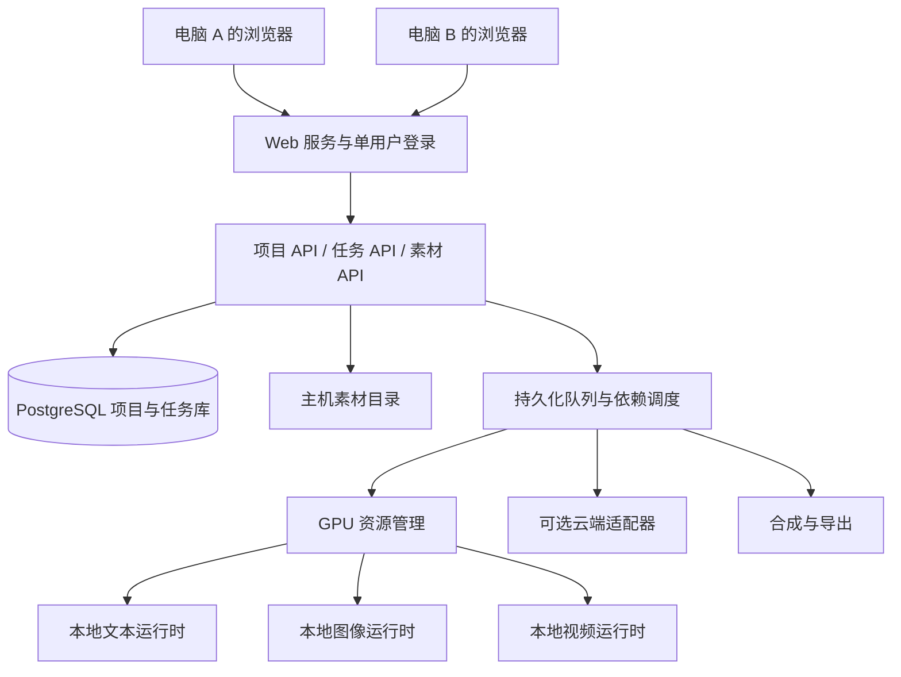

# MyVideoCreator 产品与实现研究

研究日期：2026-09-09。状态：设计研究基线；已开始实现，最新开发与验收情况见 IMPLEMENTATION_STATUS.md。

## 1. 结论与范围

实现一个以节点画布为核心的个人 AI 视频创作 Web 应用。浏览器提供与参考产品相近的创作体验；有 GPU 的主机运行模型、队列、素材存储和导出服务；其他电脑通过浏览器访问同一工作室。

当前产品以云端生文、生图、生视频为主要路径，同时保留内置和自定义本地模型；参考同级 TestMaestro 的本地模型操作逻辑；首版不做团队和协作。

当前路线（按用户后续修订）：产品与调度层独立实现；将 Maestro / WanGP 推理实现移入本项目，使用独立 Python 环境与模型目录。个人非商业学习使用，保留来源与许可证。运行时不依赖外部 TestMaestro 项目。默认 Qwen 27B、Flux Klein Base 9B + 指定 LoRA、MiniMax H3 INT8 + 已有 Qwen3-VL Q2_K；Q4 编码器暂不补装。

## 2. 参考产品的实际观察

研究页面：[Lumina 创作画布](https://www.xmzyvr.com/canvas?projectId=proj_dcee58b4ed364d49933f047d2165e882&workflowId=wf_34d108e149854c1db61db468651e4638)。以下是浏览器界面的观察，不是服务器源码分析。

| 模块 | 已观察到的行为 | 设计取舍 |
| --- | --- | --- |
| 画布 | 深色点阵背景、节点连线、缩放、小地图、定位、整理画布、复制节点 | 保留核心交互，改进新增节点避让与布局 |
| 文本 | 输入故事要求、选模型与渠道、语言、报价、异步生成、编辑结果 | 加入结构化剧本和镜头数据，保留自由文本节点 |
| 图像 | 文本提示、素材引用、风格、提示词库、数量、画幅、分辨率和质量 | 参数随模型能力变化，不展示无效选项 |
| 视频 | 文生视频、图生视频、首尾帧、图片参考、全能参考入口；运镜、角色库 | 主线优先做文生视频与图生视频；其他能力按适配器支持开放 |
| 智能分镜 | 一次创建资产库、视觉分析、分镜解析/生图三个关联节点 | 保留“构图信息与身份资产分开”的职责设计 |
| 引用校验 | 首帧占位图缺少有效素材版本时阻止执行 | 使用明确的素材 ID、版本与输入校验；错误信息面向创作者 |
| 提示词 | 可见视觉分析要求；提示词广场、收藏、个人模板 | 自建可编辑、可版本化模板库 |
| 导演台 | 独立 3D 空间/多机位入口，打开时看到连接状态 | 不是首版视频闭环的依赖，后续单独实现 |
| 其他 | 全景图、宫格分镜、播放列表、素材库、历史版本入口 | 核心闭环后补齐；本轮未完整测试这些模块 |

### 已做的样例操作

在原本为空的当前画布中创建了研究节点，使用虚构题材“雨后小巷的橘猫与小机器人”。没有上传用户本地文件。

- 文本：要求 15 秒、3 个镜头、每镜约 5 秒，输出含画面、景别、运镜、声音；生成成功，界面报价并扣除 10 积分。
- 图像：以自写的单镜提示词生成电影写实图，选择 16:9；生成成功，界面报告 1024 × 576，扣除 15 积分。
- 视频：提交 Kling Video 3.0 V3 的 5 秒、720P 文生视频样例，报价 120 积分。最终结果见本文末尾的试用补充。
- 首帧入口：自动创建首帧占位节点；缺少素材版本时，产品阻止执行。本轮没有完成真实图生视频样例，不将其列为已验证链路。

画布上的模型名称和渠道仅代表该站点当天的显示，例如图像菜单的 GPT Image、Banana 和多个渠道，以及视频菜单的 Kling、Veo、Seedance、Wan、PixVerse 等；本轮不验证渠道实际底层模型身份或全部可用性。

### 提示词研究边界

可以参考公开界面上的字段、可编辑提示词和生成结果，重建相近的创作逻辑。没有取得该站点完整后台系统提示词，因此不能承诺逐字复刻隐藏提示词或得到相同模型输出。

值得采用的规则：源分镜提供构图、姿态、遮挡、镜头；角色/道具/场景资产提供身份与材质；风格预设独立提供成片风格。草图的白纸、黑线、标注和页面排版不能误当作最终场景的颜色与风格。匹配不到资产时显示缺失，不编造已存在的资产 ID。

## 3. TestMaestro 的源码与本机条件

位置：`C:/Users/kunpeng/Documents/ChatGPT/TestMaestro/Maestro`。

| 源文件 | 已核实内容 | 新项目采用的思路 |
| --- | --- | --- |
| `app/launch.py` | FastAPI 提供 React 页面、REST API；生成接口立即返回 job_id | 前后端同源部署、任务异步提交 |
| `app/services/llm_service.py` | 本地 llama-server 子进程、GGUF 缓存、动态端口、状态探测；空闲 60 秒卸载；远端 provider 分流 | 独立文生运行时与 provider 适配器，按需加载，保留日志与超时诊断 |
| `app/services/director/planners/short_film.py` | 剧本与镜头规划、中文输出约束、JSON Schema | 分阶段生成与校验，中文剧本和人名不被模型改写 |
| `app/services/director/schema.py` | ProductionPlan、ShotPlan、角色、摄影、声音和引用资产的结构化类型 | 建立统一中间数据；不同模型使用不同最终提示词 |
| `app/services/director/orchestrator.py` | planner、renderer、validator 分层 | 创作逻辑与模型输入协议分离 |
| `app/services/director/image_prompt_rules.py` | 根据图像模型选择提示词规则；区分角色/场景参考 | 按模型、模式和参考图角色编译提示词 |
| `app/services/director/renderers/ltx_i2v.py` | 图生视频聚焦首帧之后的动作、表情、运镜与声音变化 | 不向图生视频重复塞入整篇剧本 |
| `app/services/director_pipeline.py` | 后台执行、项目级与子任务级队列、保存检查点、单镜重跑、GPU 互斥、阶段间释放模型 | 页面关闭不中断；按镜头保存完成状态；共享 GPU 调度 |
| `app/services/job_lifecycle.py` | 取消/完成状态的原子转换、任务输出归属 | 防止取消后被迟到结果改回成功，避免任务错领文件 |
| `app/services/perf_recommend.py` | 根据显存和内存选择 profile、量化与 VAE 配置 | 硬件感知的配置预设，而非统一最高质量 |

注意：Maestro 的通用 `/api/v1/llm/generate` 路由未把 `json_schema` 传给内部服务；不能仅接这一条 API 就声称具备结构化约束。可选桥接需选择正确的规划接口，或由独立 llama-server 适配器发送约束请求。

### 实测硬件与本地模型文件

- NVIDIA GeForce RTX 3060，12GB 显存；系统内存约 63.8GB。
- 当前配置可见 profile=4、INT8、VAE 自动配置。
- 已发现 Gemma 4 E4B Q4 GGUF（约 4.97GB）、Qwen3.8 27B Q4 GGUF（约 15.41GB）。配置中当前选择的是后者，README 默认推荐与当前选择并不相同。
- 已发现 Flux 2 Klein 9B INT8（单份约 8.79GB）、LTX 2.3 22B distilled INT8（主权重约 18.11GB）、MiniMax H3 及若干编码器/VAE 权重。
- 这些是文件和配置核查，不代表已验证每个模型可以成功生成，也不能按权重文件大小直接推断峰值显存。

首版优先使用已安装且通过自检的模型。轻量 GGUF 可作为默认文生候选；27B 保留为质量选项。生图优先验证现有 Flux，生视频优先验证现有 LTX 路线。需要实测冷启动、每步耗时、内存和峰值显存后才能确定默认分辨率与单镜时长。

12GB 显卡默认一个重型 GPU 任务：先完成剧本和镜头提示词，释放文生模型；批量生成参考图；释放图像模型；按镜头生成视频；最后合成。兼顾依赖关系和模型切换成本。不能让三个大模型同时常驻，也不能承诺本地速度达到云端水平。

### 许可证对实现路线的实际影响

本地 `LICENSE` 明确标注 WanGP Non-Commercial Evaluation License 1.1，并限制付费产品、托管服务、API 和商业集成。这里只报告所读许可证文本，不对未来具体分发场景作法律结论。主方案独立实现；若将来选择复用其代码或部署其后端，需要按实际用途解决授权。模型权重和第三方组件另有各自条款。

## 4. Web 部署与跨电脑访问



- 浏览器端不安装模型、不要求显卡，不依赖访问者电脑的本地磁盘路径。
- GPU 主机同时提供页面和 API。生产配置同源，避免跨设备出现 `localhost` 指向错误或 CORS 配置混乱。
- 素材通过受控 HTTP URL 流式读取，支持视频 Range 请求与预览缩略图。数据库保存资产 ID 和相对存储位置，不把服务器绝对路径暴露给前端。
- 局域网模式提供 `http://主机局域网地址:端口`；外网模式可使用私人组网，或 HTTPS 反向代理与认证。部署时再配置网络，不在研究阶段修改防火墙。
- 不做团队系统，但跨电脑访问保留一个工作室账户、会话管理和接口认证。推理子服务默认只监听回环地址，由业务后端调用。
- 同一用户开多个浏览器时，用项目 revision/乐观锁防止覆盖；不是多人协作功能。
- SSE/WS 推送进度，断线后按事件序号重连；页面关闭后任务继续执行。服务器重启后恢复完成步骤，运行中的任务先核对引擎/云端状态，不能盲目重复付费提交。

## 5. 产品流程与界面

提供“画布”和“分镜表”两个视图，操作同一份项目数据。

1. 创建项目：主题、目标时长、画幅、语言、视觉风格和默认生成模型。
2. 生成剧本：梗概、人物、场景、叙事节奏；可编辑并锁定版本。
3. 生成分镜：镜号、秒数、画面、景别、机位、运动、动作、对白/声音、角色与场景引用。
4. 准备资产：角色定妆、场景、道具；上传或本地生成，多镜头复用。
5. 生成分镜图：先出低成本草稿，再选定成片参考图；单镜重做与多版本对比。
6. 生成视频：文生/图生/首尾帧由能力决定；可单镜、选中镜头、整段执行。
7. 合成：镜头排序、裁剪、基础转场、配音/BGM、字幕与 MP4 导出。

主界面：顶部项目与任务状态；左侧节点/资产/模板入口；中央画布或分镜表；右侧属性与提示词；底部可展开时间线和任务抽屉。沿用参考产品深色电影工作室的视觉方向，自建品牌和组件。

每个生成节点显示：模型、执行位置、本次配置、排队/加载/生成/编码状态、结果版本。云端显示费用预估，本地显示排队和耗时估计。没有引擎真实百分比时只显示阶段和已用时，不伪造线性进度。

项目优先使用项目设置中选定的文本、图像和视频模型。没有项目设置时优先采用已配置的云端服务，本地服务仍可按项目或节点选择；失效的显式配置不会静默切换。

## 6. 提示词与创作引擎

核心采用“结构化创作计划 → 按模型编译最终提示词”。保存原始需求、模板版本、模型配置和最终输入，方便重现和比较。

### 阶段 A：剧本

输入：用户需求、时间预算、风格、角色设定。输出：故事摘要、角色表、场景表、段落节奏。先解决叙事，不同时让小模型输出很长的镜头数组。

原创模板方向：你是短片编剧。围绕给定事件编写可拍摄的剧本，严格保持用户锁定的人名、对白和结局；限制角色与场景数量，使事件在目标时长内成立；不添加无关支线。

### 阶段 B：分镜

把锁定剧本转换为校验过的 ShotPlan。每镜一个主要动作，镜头时长对齐模型支持范围；多镜总长与目标时长一致，必要时在剪辑阶段处理模型实际帧数差异。

字段：`shot_id / duration / scene_id / character_ids / visible_action / camera / lighting / dialogue / audio / start_state / end_state / continuity / image_prompt / video_prompt`。

本地模型支持时使用 JSON Schema 约束；再做语义校验和有限修复。JSON 可解析不代表角色、时长与动作合理。逐段规划并保存检查点，避免一个超长请求失败后全部重来。

### 阶段 C：分镜图

输入：当前镜头、构图控制、角色身份资产、场景资产、独立风格设定。

原创模板方向：描述当前镜头的一个确定瞬间；保持角色的外观与服装；准确指定前中后景及遮挡；区分身份参考、构图参考、场景参考和风格参考；不要把后续动作同时画成多格漫画。

### 阶段 D：视频

- 文生视频：补全主体、环境、起始状态、动作节奏、摄影、声音。
- 图生视频：围绕已有首帧写接下来发生的变化；不重新发明角色造型和背景。
- 首尾帧：表达两帧之间可实现的动作，不把每次切镜强制变成连续形变。
- 模型不支持原生音频时，将声音送到独立音频步骤；不保留表面可选但实际无效的参数。

示例图生视频输入：“橘猫缓慢伸出前爪，轻触机器人胸前的圆灯。灯光由暗渐亮成暖橙色，机器人轻微抬头。低机位中近景缓慢推近，保持两者造型和位置稳定，动作在五秒内完成。”

一致性主要依靠稳定资产引用、角色与服装锁定、镜头前后状态、模型支持的参考图/控制能力，以及结果人工选择；不能只靠反复追加“保持一致”。固定 seed 也不构成跨镜身份保证。

## 7. 模型适配与任务执行

统一的 ProviderAdapter 提供：能力查询、就绪检查、预估、提交、查询状态、取消、收集结果。文本增加流式输出；媒体任务支持异步 job ID。

每个模型能力声明包括：输入/输出类型、文生图/图生图/文生视频/图生视频/首尾帧/多参考/音频、可用画幅、分辨率、时长、参考图上限、negative prompt、seed、取消能力、结构化输出能力。

模型与渠道分开：相同模型可以由官方 API、兼容网关或本地引擎提供；不把渠道名称当成模型本体。云端视频没有统一通用协议，需按供应商实现参数、上传、轮询、错误与费用映射。“支持市面模型”的实现方式是可扩展注册表和持续增加已验证适配器，不是一个通用 URL 立即兼容全部模型。

首批适配器建议：

1. 本地 llama.cpp/OpenAI-compatible 文本服务，支持扫描/导入现有 GGUF。
2. 本地图像/视频 worker。可采用 ComfyUI API 的固定工作流，或独立 Python 推理适配器。现有 Maestro 特定量化格式不保证可直接给其他运行时加载，需要逐模型验证。
3. 可选 Maestro 桥接：个人本地研究阶段验证既有模型，保留版本检查，不侵入原项目。
4. 云端先完成一种文本、一种图像、一种视频的真实接入，再扩展其他供应商；具体型号在实现时按账户权限与官方接口核验。

任务状态建议：draft → queued → preparing → running → postprocessing → succeeded；另有 cancelling/cancelled/failed/interrupted。超时不直接等价于生成失败，需查询引擎状态。重试采用固定提交 ID 和 provider job ID；失败镜头可重跑，完成的镜头不重复生成。

GPU 调度属于服务端；租约/锁防止不同浏览器的请求抢占同一张卡。按依赖与模型类型组织批处理；OOM 后释放当前运行时，再选择降低配置或等待用户修改。任何自动降级都记录实际参数，不能悄悄改变交付规格。

## 8. 技术方案与数据

建议前端：React + TypeScript + Vite + React Flow + Zustand。React Flow 用于自定义媒体节点、连线、选择、缩放与保存恢复；业务数据独立于节点坐标存储。

当前后端：Python FastAPI + Pydantic + PostgreSQL + 独立 Worker 进程。P2 不引入 Redis 集群；多 Worker、租约与远程调度留给 P6。

合成与导出：独立渲染接口，主打镜头拼接、基础字幕和音轨混合。可直接调用媒体处理引擎；需要复杂标题/动效模板时再加入独立的 HTML 合成能力。此阶段仅设计应用，不生成视频成品代码。

核心实体：Project、ProjectRevision、WorkflowNode、WorkflowEdge、ScriptRevision、Character、Scene、Shot、Asset、AssetVersion、GenerationJob、Provider、ModelCapability、PromptTemplate、Timeline、ExportJob。

节点运行快照固化：输入资产版本、提示词版本、模型/运行时版本、seed、参数、输出归属。上游修改后，标记下游结果过期，但保留旧版本供比较，不自动耗费资源重跑。

建议目录：

```text
frontend/                  Web UI
backend/api/               业务接口与认证
backend/domain/            项目、剧本、分镜、资产
backend/workflows/         依赖与执行状态
backend/providers/         本地和云端适配器
backend/workers/           GPU 与导出任务
backend/prompts/            独立编写的模板及模型规则
PostgreSQL                 项目、版本、任务和业务事件（P2 唯一主库）
data/assets/               版本化素材
data/exports/              导出文件
```

## 9. 开发顺序与验收

### 第一阶段：Web 基础与本地闭环

- 可从另一台电脑登录；项目保存/恢复、节点画布、分镜表、素材上传与服务端预览。
- 本地模型发现和状态；一套文本、图像、视频适配器；后台队列与真实进度。
- 用三个镜头完成：故事 → 分镜 → 图像 → 视频 → 简单 MP4 合成。
- 验收：默认路径无云端调用；浏览器关闭后任务继续；另一电脑可看同一进度与结果。

### 第二阶段：创作质量与恢复

- 角色/场景资产复用、提示词模板、模型规则、单镜重跑、多版本对比。
- 失败重试、取消、服务重启恢复、显存协调、模型安装/导入进度。
- 基础时间线、音轨、字幕、导出。
- 验收：改一个镜头只重新生成必要下游；结果与输入版本对应；无重复提交导致的重复费用。

### 第三阶段：云端与扩展工具

- 官方 API/兼容网关、预算与费用记录、本地与云端混合项目。
- 宫格分镜、更多参考模式、全景、进阶 3D 导演台。
- 验收：能力不支持时在提交前阻止；本地故障不自动收费；不同供应商错误能被统一解释。

尚需在实现中验证：本地视频的实际耗时与稳定档位、现有量化权重的运行时兼容性、完整图生视频引用链、视频成片质量、导出音画同步。首版进度以这些实测门槛评估，不预先承诺所有模型同等效果或精确工期。

## 10. 技术参考

- [React Flow 自定义节点](https://reactflow.dev/learn/customization/custom-nodes)：节点选择、拖拽、端口与自定义内容。
- [React Flow 保存与恢复](https://reactflow.dev/examples/interaction/save-and-restore)：节点/连线与视口序列化。
- [llama.cpp server](https://github.com/ggml-org/llama.cpp/blob/master/tools/server/README.md?plain=1)：本地 HTTP 服务与结构化输出接口。
- [ComfyUI 服务端路由](https://docs.comfy.org/development/comfyui-server/comms_routes)：提交工作流、队列和 WebSocket 进度。
- 本地源码证据以第 3 节所列路径为准；本轮没有修改 TestMaestro、下载模型或启动本地生成任务。

## 11. 试用补充

视频任务最终失败。节点的可见提示属性为：模型服务账户额度不可用，请联系管理员检查账户余额或额度。该信息来自站点自身错误提示，不能据此认定用户积分不足。

研究前页面余额为 3,224，文本后为 3,214，图像后为 3,199，视频失败后仍显示 3,199。因此本轮界面观察的净消耗是 25 积分；没有检查独立账单明细。

图像节点显示 1024 × 576 的生成结果，缩略图已成功加载（浏览器读取的缩略图自然尺寸 720 × 405）。视频仅验证了参数选择、报价、异步提交和失败反馈；没有获得可评估的视频成片，不能声称已完整跑通自动成片或图生视频。

对新产品的直接要求：错误归类区分上游额度、鉴权、限流、不支持的输入、缺失引用和本地 OOM；说明可执行的恢复操作；保存失败任务输入和提交 ID，避免重试时丢提示词或重复扣费。
